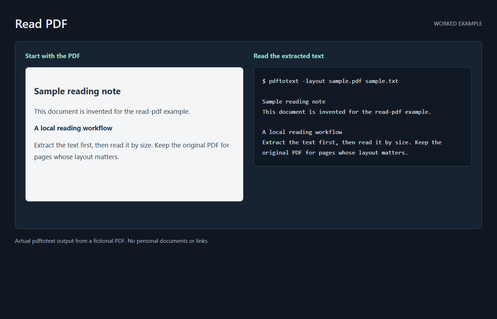

# read-pdf

A Claude Code skill for reading PDFs at ~10-25x fewer tokens than letting the
agent open them visually. Built for the "phone browser -> Print to PDF -> drop
folder" capture flow (Reddit threads, articles), but it works on any PDF with a
real text layer.

## The problem

A mobile print-to-PDF is a 1-3MB file whose useful content is ~8-20KB of text.
Agents default to expensive paths:

- Reading the PDF directly renders pages as **images** -- thousands of tokens
  per page.
- PDF metadata tools choke on browser prints: a page printed from a link-dense
  site carries **hundreds of duplicate link annotations** (nav chrome). One
  metadata call on a 6-page Reddit print returned ~50KB of JSON and still
  truncated at 89 of 659 annotations.

## The fix

`pdftotext` (poppler), locally, before any tokens are spent -- then read the
tiny text file. The skill encodes the full procedure: triage with `pdfinfo`,
extract to a scratch file, read by size, plus the fallback ladder for raster
pages and a pypdf recipe for salvaging links (which pdftotext drops).

## Measured (6 real mobile print-to-PDFs, 2026-08)

| | |
|---|---|
| Input | 12.3MB across 6 PDFs (53 pages, Firefox + Brave mobile prints) |
| Output | 74.5KB of clean text (~19k tokens) |
| Wall time | 0.93s for all six |
| Same content read visually | ~80k+ tokens (53 pages as images) |

Independent write-ups of the same pattern report 24-51x token cuts on longer
documents (see [book-to-skill](https://booktoskill.is-a.dev/guide/)).

The skill also documents the per-browser artifacts so the agent reads through
them instead of re-extracting: Firefox/cairo repeats a header with the source
URL on every page (useful!); Brave/Skia occasionally weaves overlay text
letter-by-letter into a body line (ugly, still readable).

## Install

1. Install poppler: `apt install poppler-utils` / `brew install poppler` /
   (Windows) ships with Git for Windows' MSYS environment, or install a
   poppler release.
2. Copy the `SKILL.md` into a `read-pdf/` folder under your skills directory
   (`~/.claude/skills/read-pdf/SKILL.md`).

## Limitations

- Raster/screenshot PDFs have no text layer -- the skill detects this
  (near-empty output) and escalates to OCR/rendering on specific pages only.
- Collapsed Reddit comments are absent from the PDF itself; nothing recovers
  them after printing. Expand before you print.

## License

MIT
